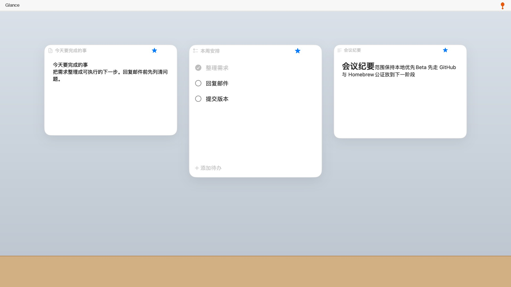
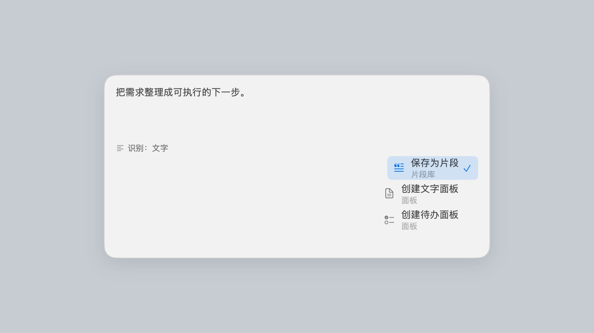
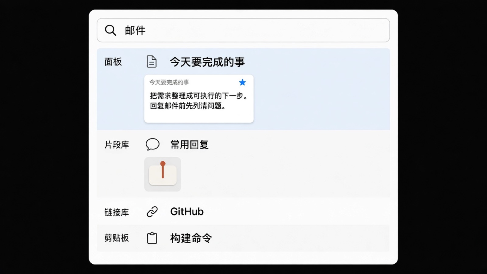
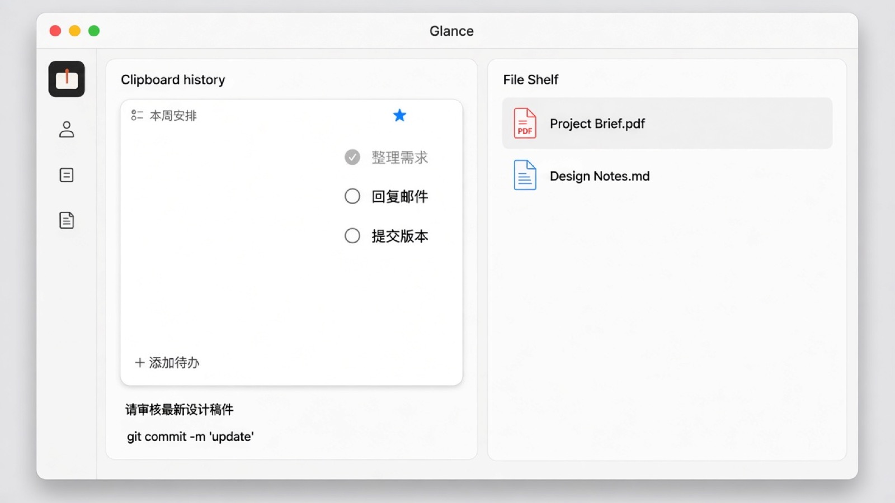

<p align="center">
  
</p>

<h1 align="center">Glance</h1>

<p align="center"><strong>把重要内容留在眼前，也把常用工具收进菜单栏。</strong></p>

<p align="center">轻量 · 本地优先 · 原生 macOS 个人办公工具</p>

<p align="center">
  <a href="https://github.com/Eric-Ruan-jingwei/Glance/releases/tag/v0.27.0-beta.2"></a>
  <a href="https://github.com/Eric-Ruan-jingwei/Glance/releases/tag/v0.27.0-beta.2"></a>
  <a href="https://github.com/Eric-Ruan-jingwei/Glance/releases/tag/v0.27.0-beta.2"></a>
  <a href="https://github.com/Eric-Ruan-jingwei/Glance/actions/workflows/ci.yml"></a>
  <a href="LICENSE"></a>
</p>

<p align="center">
  
</p>

## 安装

需要 **macOS 14 Sonoma** 或更新版本。当前 Beta 是 **Universal 2**（Apple Silicon 与 Intel）。

### Homebrew

```bash
brew install --cask Eric-Ruan-jingwei/glance/glance
```

```bash
brew uninstall --cask Eric-Ruan-jingwei/glance/glance
```

卸载应用不会删除 `~/Library/Application Support/Glance` 里的数据。Homebrew 不会绕过 Gatekeeper。

如果更习惯先 tap：

```bash
brew tap Eric-Ruan-jingwei/glance
brew trust --cask Eric-Ruan-jingwei/glance/glance
brew install --cask glance
```

推荐第一条 fully-qualified 命令：只信任 Glance 这个 cask，而不是整个 tap。

### DMG

下载 [Glance 0.27.0 Beta 2](https://github.com/Eric-Ruan-jingwei/Glance/releases/tag/v0.27.0-beta.2)，打开 `Glance-0.27.0.dmg`，把 Glance 拖进 Applications。

Glance 是菜单栏应用：请看菜单栏里的图钉图标，不要在 Dock 里找。

### Beta 提示

当前构建是 **ad-hoc 签名**，**未经 Apple 公证**。部分 Mac 第一次打开会被拦。请到 **系统设置 → 隐私与安全性 → 仍要打开**。

不要关闭 Gatekeeper，也不要使用 `xattr` 或 `spctl --master-disable`。

## Glance 是什么

Glance 是一个轻量、本地优先的 macOS 个人办公工具入口。

它把面板、剪贴板、文件架、片段库、链接库和全局搜索放进同一个菜单栏工具，再用 Quick Capture 和跨工具操作把它们连起来。

Glance 不是单纯的悬浮面板 App。面板与剪贴板、文件架、片段库、链接库、全局搜索是平级能力：有的内容要一直看见，有的只要随手握住、找得到、用得上。

数据只留在这台机器上。没有账户，也没有云同步。

## 六个核心工具

| 工具 | 用来做什么 |
| --- | --- |
| 面板 | 把文字、待办、Markdown、图片、PDF 长期浮在桌面 |
| 剪贴板 | 留下最近复制的文字和图片，需要时写回系统剪贴板 |
| 文件架 | 保存文件引用，不复制原文件 |
| 片段库 | 保存长期复用的文本，例如回复、命令、地址 |
| 链接库 | 保存有意留下的网页，用默认浏览器打开 |
| 全局搜索 | 在上述本地数据里找回任何一条 |

Quick Capture（默认 `⌥⌘J`）是统一入口：先判断内容，再由你选择放进哪个工具。它不是第七个顶层工具。

## 一套连起来的工作流

<p align="center">
  
</p>

Glance 的重点不是六个孤立的小工具，而是 **Capture → Store → Find → Act**。

- 剪贴板 → 片段 / 链接 / 面板
- 片段 → 面板
- 链接 → 面板
- 文件架中的图片或 PDF → 面板
- 全局搜索 `⌘Enter` → 在来源里显示

派生出面板时，源记录不会被删除或改写。

## 界面

<table>
  <tr>
    <td width="50%">
      
      <p align="center">快速记录</p>
    </td>
    <td width="50%">
      
      <p align="center">全局搜索</p>
    </td>
  </tr>
  <tr>
    <td colspan="2">
      <p align="center">
        
      </p>
      <p align="center">剪贴板与文件架</p>
    </td>
  </tr>
</table>

## 为什么是 Glance

**本地优先。** 无账户、无云同步。全局搜索不上传查询，也不去网上抓内容。

**原生 macOS。** AppKit 浮窗加 SwiftUI 设置，菜单栏常驻，Universal 2。

**随手可达。** 全局快捷键、Quick Capture、全局搜索。从任何应用里记下一条，再在 Glance 里找回来。

**工具之间互通。** 复制、打开、做成面板都走明确的本地动作，没有「AI 自动整理」。Glance 不是 AI 产品。

## 快捷键

| 动作 | 默认 |
| --- | --- |
| 快速记录 | ⌥⌘J |
| 全局搜索 | ⌥⌘K |
| 剪贴板 | ⌥⌘V |
| 文件架 | ⌥⌘F |
| 片段库 | ⌥⌘S |
| 链接库 | ⌥⌘L |
| 从当前剪贴板创建 | ⌥⌘B |
| 隐藏 / 显示 | ⌥⌘G |

可在设置里修改。完整交互说明见 [快捷键](docs/shortcuts.md)。

## 隐私

- 数据留在本机，不需要账户
- 不上传搜索内容
- 不自动读取网页标题或图标
- 文件架只保存引用；移除条目不会删除 Finder 里的原文件
- 面板中的图片和 PDF 会复制进 Glance 自己的数据目录

## 开发者

```bash
git clone https://github.com/Eric-Ruan-jingwei/Glance.git
cd Glance
./scripts/package-macos.sh
open dist/Glance.app
```

需要 macOS 14+ 与 Xcode 或 Command Line Tools。

- 使用说明 → [docs/user-guide.md](docs/user-guide.md)
- 技术架构 → [docs/architecture/core-platform-boundary.md](docs/architecture/core-platform-boundary.md)
- 数据格式 → [docs/architecture/data-format.md](docs/architecture/data-format.md)
- 版本记录 → [CHANGELOG.md](CHANGELOG.md)

当前应用版本 **0.27.0**（Build 51）。数据库 schema 仍是 Panel 5、Clipboard / File Shelf / Snippet / Link 1。

## License

[MIT](LICENSE)
